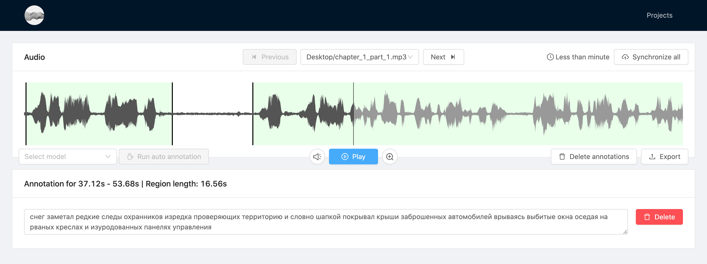

# media-annotator
Web-based annotation tool for media data.




# Features
- Uploading selected audio-files from directory. Currently, only `.wav` `.mp3` files are supported. 
- Manual and auto transcribing for 20+ languages and dialects via [Vosk](https://alphacephei.com/vosk) **Note**: Auto annotation will use the first channel of `.mp3`.
- Export of the speech regions as `zip` of `wavs` and `regions.csv` or `regions.json`

## How to use
    
1. Run app as docker image
   
    ```docker-compose up -d```
2. [Open app page](localhost:3000/projects)

<details>
  <summary>How to debug</summary>

1. Install [conda](https://docs.conda.io/projects/conda/en/stable/user-guide/install/index.html#)/[miniconda](https://docs.conda.io/en/latest/miniconda.html)/[micromamba](https://mamba.readthedocs.io/en/latest/installation.html#micromamba) and [node+npm](https://nodejs.org/en/download)

2. Clone repository, create python environment using conda manager and activate it

    ```bash
    git clone https://github.com/ruslantau/media-annotator
    cd annotator
    conda env create -f backend/environment.yaml
    conda activate annotator
    ```

3. Run FastAPI backend

    ```bash
    python backend/main.py
    ```

4. Install dependencies and run Nuxt frontend

    ```bash
    cd frontend
    npm install
    npm run build 
    npm run start
    ```
5.  [Open app page](localhost:3000/projects)
</details>

## TODO
- [] extend the list of supported formats (`mp4,flac,avi,etc.`)
- [] running auto annotation on selected region
- [] adding punctuation 
- [] speaker diarisation 
